# __EBS Volume Backup Automation using Lambda, EventBridge and SNS (simple notification service)__ 
## Introduction
This project automates the creation of EBS volume backups (snapshots) using AWS Lambda.
The function is triggered automatically by Amazon EventBridge, and once the snapshot is created, a notification is sent to your email using Amazon SNS.

This ensures regular, reliable, hands-free backups without manual work.

## Project Objective

* Automatically create EBS volume backups.

* Schedule backup using EventBridge (cron).

* Send email notifications via SNS.

* Reduce manual effort and prevent human error.

#### Architecture: 
EBS Volume → Lambda Function → EventBridge Trigger → SNS Email Notification
  
### Step 1: Create a Lambda Function
* Open AWS Lambda console -> Click create function -> Author from scratch
  
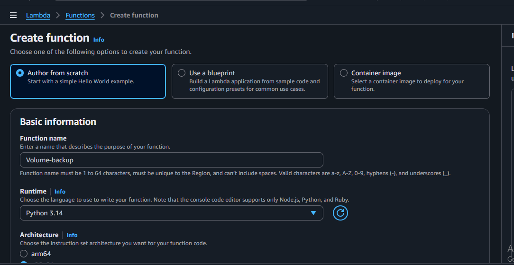
* Runtime → Python  3.14
* Architecture → x86_64
* Default execution role
* Click Create Function
  
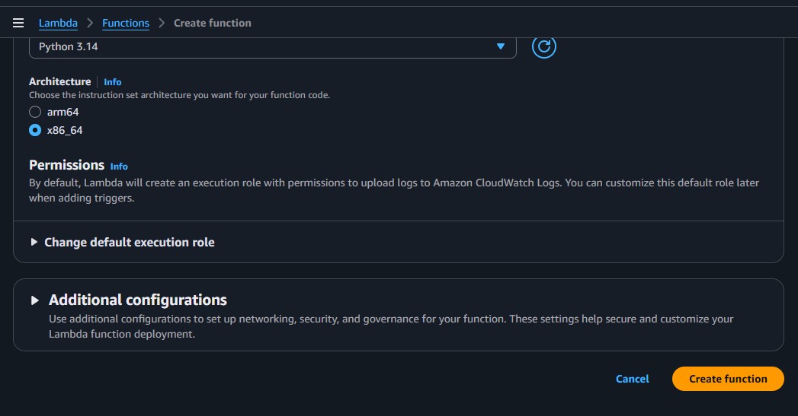

Here, Successfully created Lambda Function

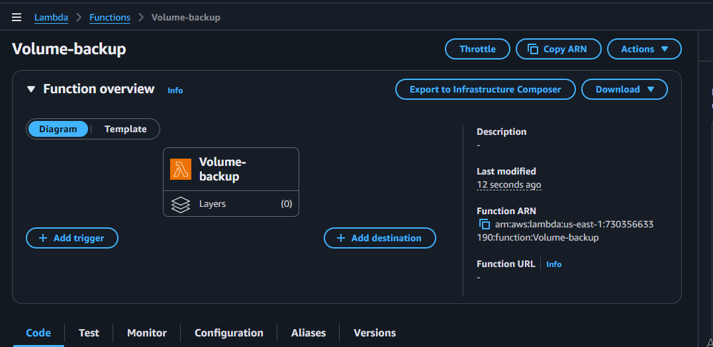

### Step 2: Add Code for Creating EBS Snapshot

    import boto3

    def lambda_handler(event, context):
    regions = []
    # Get a list of all regions
    ec2_client = boto3.client('ec2')
    regions_response = ec2_client.describe_regions()

    for region in regions_response['Regions']:
        regions.append(region['RegionName'])

    snapshots_created = []

    # Iterate through each region
    for region in regions:
        print(f"Processing region: {region}")
        ec2 = boto3.client('ec2', region_name=region)

        # Get all volumes in 'in-use' state
        volumes = ec2.describe_volumes(
            Filters=[{'Name': 'status', 'Values': ['in-use']}]
        )['Volumes']

        for volume in volumes:
            volume_id = volume['VolumeId']
            print(f"Creating snapshot for Volume: {volume_id}")

            # Create a snapshot
            try:
                snapshot = ec2.create_snapshot(
                    VolumeId=volume_id,
                    Description=f"Snapshot of {volume_id} from region {region}"
                )

                snapshots_created.append({
                    "Region": region,
                    "VolumeId": volume_id,
                    "SnapshotId": snapshot['SnapshotId']
                })

                print(f"Snapshot created: {snapshot['SnapshotId']}")

            except Exception as e:
                print(f"Error creating snapshot for volume {volume_id} in region {region}: {str(e)}")

    return {
        "statusCode": 200,
        "body": f"Snapshots created: {snapshots_created}"  }

* After the Lambda function is created, scroll down the code section and remove default code and paste above code.
* Click Deploy
  
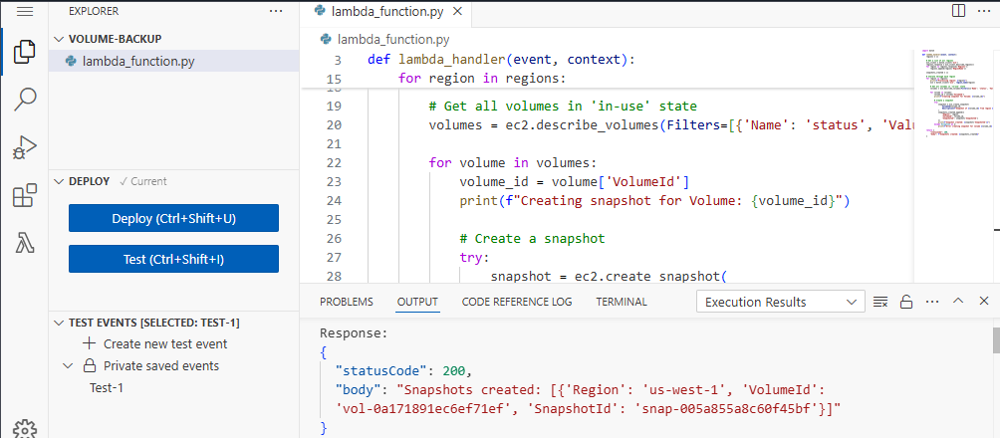      
### Step 3: Create SNS Topic for Email Notification

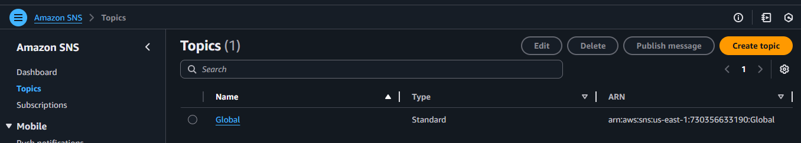 
* Scroll down -> Create subscription in protocol enter your email address
* Go to your inbox and click confirm subscription
  
 

### Step 4: Attach Permissions to Lambda Role
* Open IAM Console → Roles.
*  Search for the role created for your Lambda → example: demo-function-role.
*  Click Attach policies.

* Add
  
  AmazonEC2FullAccess

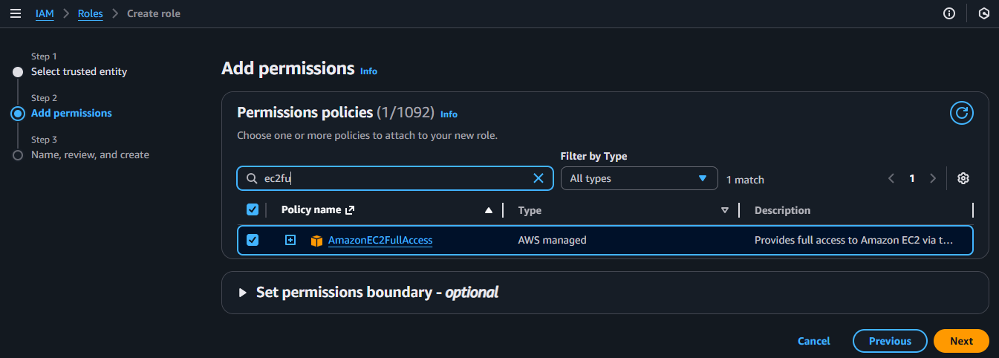

* Enter the role name
  
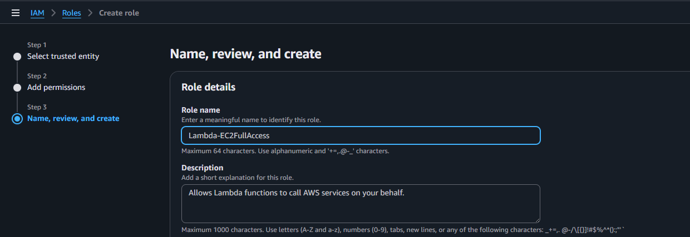

* Attach Role to your Lambda Function
  Open Lambda Console → Functions

1. Select your function: Volume-backup
2.  Go to Configuration → Permissions
3. Click Edit under Execution Role
4.  Select: 
5.  Use an existing role

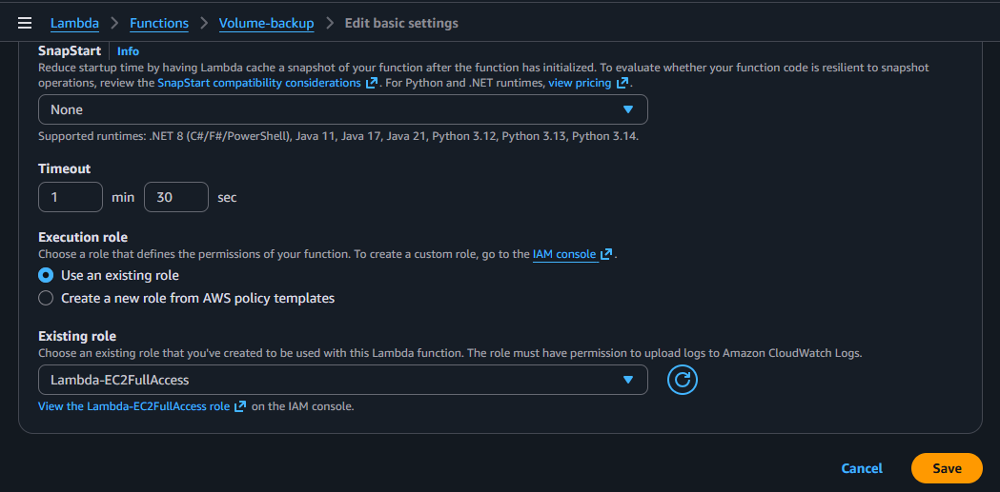
### Step 5: Verify Snapshot in EC2 Console

* Go to AWS EC2 Console.

* On the left panel → Click Snapshots under Elastic Block Store (EBS).

 You will see the automatically created snapshot from your Lambda function.

 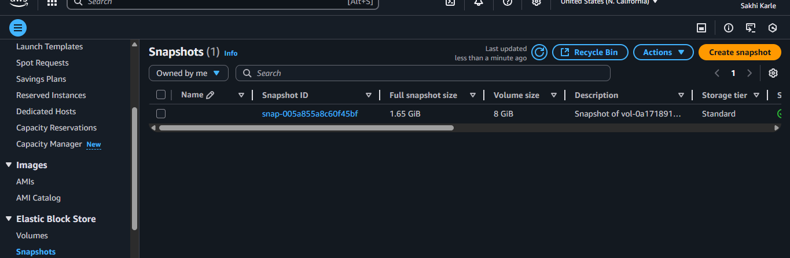

To create an EBS volume, you must have at least one EC2 instance running, because EBS volumes attach to EC2 instances.

### Step 6: Create EventBridge Rule (Trigger Lambda Automatically)
* Click Create Rule.
* Rule name → rule 1

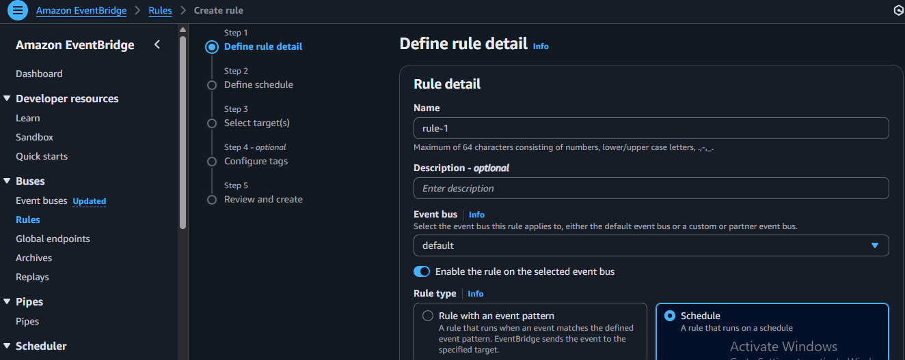
* Choose Schedule → rate
   
  Example (10 minutes):

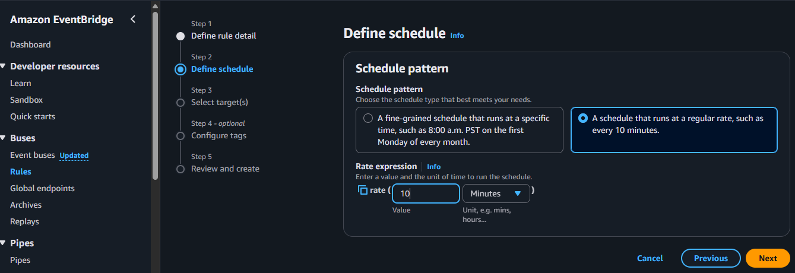

* Choose Target → sns topic
  
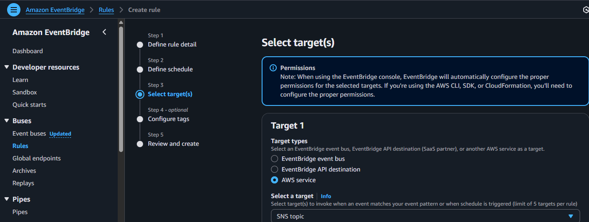
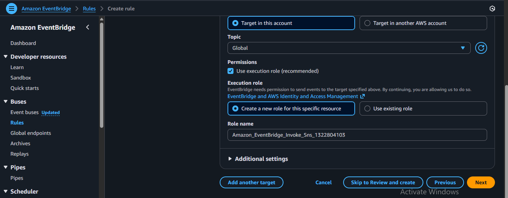
*  Click Create Rule.
  Here, Rule is Created

### Step 7: Check SNS Email Notification

1. Open your email inbox.
2. You should receive a message from SNS showing:
Snapshot ID, 
Date & Time

Confirmation that backup was created successfully

## Conclusion:
In this project, we automated the process of creating EBS snapshots across all AWS regions using AWS Lambda and EventBridge. The Lambda function identifies all in-use EBS volumes and automatically creates snapshots for backup and recovery. EventBridge triggers the Lambda function on a scheduled basis, ensuring regular and consistent backups without manual effort. This automation improves data protection, reduces operational overhead, and ensures reliable disaster recovery for critical EC2 instances.